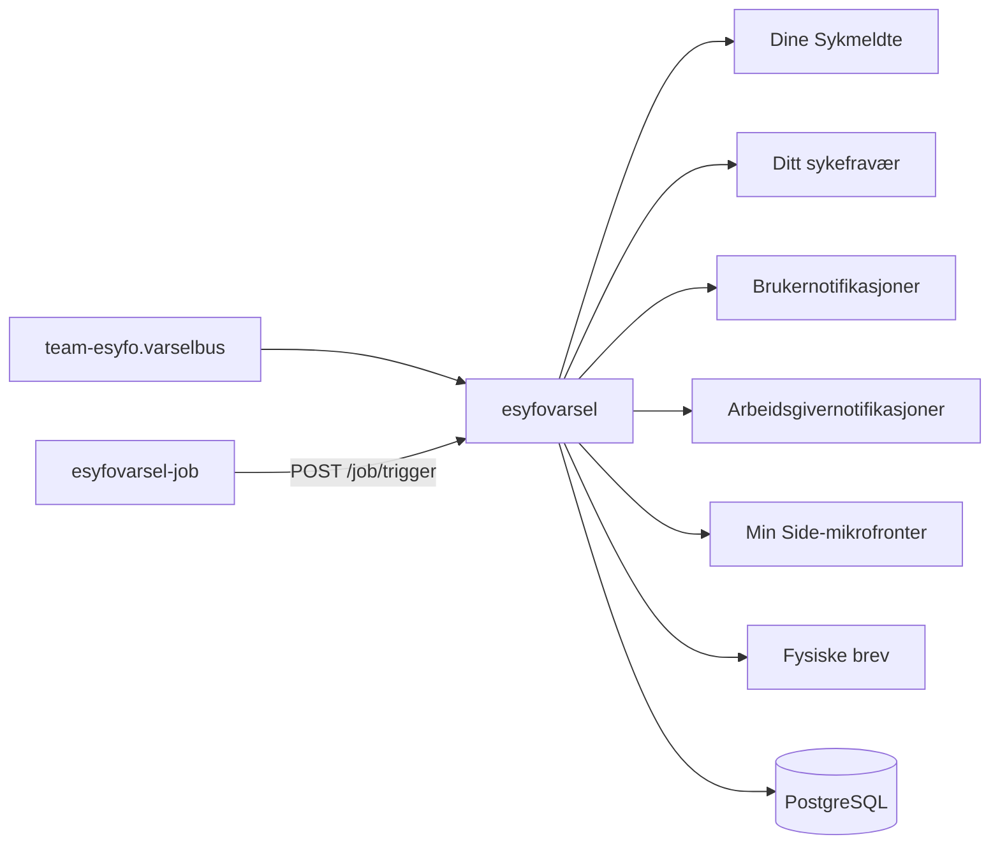

# Varsler i eSyfo

`esyfovarsel` er en Kotlin-basert backend som lytter på `team-esyfo.varselbus` og sender varselhendelser videre til riktige kanaler i eSyfo.

## Formålet med appen

Appen ruter varselhendelser videre til:

- Dine sykmeldte
- Ditt sykefravær
- Brukernotifikasjoner
- Arbeidsgivernotifikasjoner
- Min Side-mikrofronter
- Fysiske brev

Den håndterer blant annet varsler om dialogmøte, oppfølgingsplan, aktivitetsplikt, arbeidsuførhet, friskmelding til arbeidsformidling, manglende medvirkning, mer veiledning og kartleggingsspørsmål.

Appen lagrer utsendte og feilede varsler i databasen. Den har også jobber for reutsending av feilede varsler, utsending av enkelte brev og lukking av utløpte mikrofronter.

## Hovedflyt

## Kafka

Appen konsumerer fra:

- `team-esyfo.varselbus`
- `teamsykefravr.testdata-reset` i dev

Appen produserer til:

- `team-esyfo.dinesykmeldte-hendelser-v2`
- `flex.ditt-sykefravaer-melding`
- `min-side.aapen-microfrontend-v1`
- `min-side.aapen-brukervarsel-v1`

## API og endepunkter

| Metode | Sti            | Bruk                                                                     |
| ------ | -------------- | ------------------------------------------------------------------------ |
| `POST` | `/job/trigger` | Starter interne jobber for mikrofronter, reutsending av varsler og brev. |

## Jobb

`esyfovarsel-job` kaller `POST /job/trigger` for å starte interne jobber i `esyfovarsel`.

Jobben lukker utløpte mikrofronter, reutsender varsler og sender brev.

- I dev kjører jobben hvert 5. minutt.
- I prod kjører jobben hvert 30. minutt på hverdager mellom kl. 07 og 16.

## Utvikling

Se [lokal utvikling](docs/local-development.md) for lokal kjøring, Kafka-test og lokal jobbkjøring.

Se [varslingsoversikt](docs/varslingsoversikt.md) for koblingen mellom domeneapper og kommunikasjonsflater.

Bruk `mise tasks` for å se tilgjengelige oppgaver.

## For Nav-ansatte

Repoet eies av [@navikt/team-esyfo](https://github.com/navikt/team-esyfo).

[#esyfo på Slack](https://nav-it.slack.com/archives/C012X796B4L)
