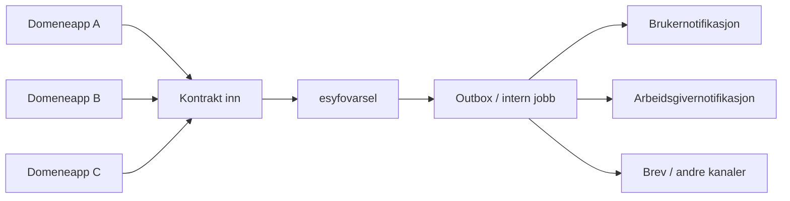

# ADR-001: Fremtidig varselarkitektur i esyfovarsel

**Dato:** 2026-06-03
**Status:** Foreslått
**Type:** Diskusjonsgrunnlag / foreslått ADR
**Beslutning:** Ikke tatt
**Beslutningstakere:** Team eSYFO, med innspill fra berørte produsentteam

## Sammendrag

Vi har ikke tatt en beslutning om ny varselarkitektur ennå. Dette er et diskusjonsgrunnlag for teamet.

Tidligere oppgaveplan for arbeidsgivervarsel pauses inntil teamet har valgt retning. Første konkrete behov kommer fra `syfo-oppfolgingsplan-backend`, men samme løsning bør kunne brukes av flere produsenter over tid.

Foreløpig anbefaling til diskusjon er:

- vurder `HTTP API inn til esyfovarsel + outbox` og `Kafka/topic inn til eksisterende esyfovarsel` som hovedspor
- vurder om oppfølgingsplan-behovet bør løses midlertidig på gammel måte hvis det reduserer risiko og tidspress
- unngå å haste inn ny arkitektur i `esyfovarsel`

## Kontekst

`esyfovarsel` er i dag en Kotlin/Ktor-applikasjon på NAIS med PostgreSQL, plain Apache Kafka, Cloud SQL og Aiven/NAIS Kafka. Appen leser fra topicet `varselbus` og sender videre til flere kanaler.

Dagens løsning har allerede mange produsenter. Topicet `varselbus` i produksjon har write-ACL for blant annet:

- `syfooppfolgingsplanservice`
- `syfo-oppfolgingsplan-backend`
- `syfomotebehov`
- `syfo-dokumentporten`
- `isdialogmote`
- `isarbeidsuforhet`
- `isfrisktilarbeid`
- `aktivitetskrav-backend`
- `meroppfolging-backend`
- `ismanglendemedvirkning`
- `isoppfolgingsplan`
- `ismeroppfolging`

`esyfovarsel` har i dag ikke et åpent inbound-API for andre apper. I produksjonsmanifestet er inbound `accessPolicy` begrenset til `esyfovarsel-job`. Et HTTP-spor vil derfor kreve eksplisitt ny inbound-policy og avklart auth-mekanisme.

Teamet har snakket om et nytt arbeidsgivervarsel-spor, men ønsker å diskutere arkitektur før oppgaver brytes ned videre. Det er også et tydelig ønske om å ikke lage en hasteløsning inne i `esyfovarsel`.

Oppfølgingsplan er første konkrete behov. Det er likevel viktig å ikke designe en løsning som bare passer dette ene behovet.

## Mål for diskusjonen

Teamet bør bruke denne ADR-en til å svare på disse spørsmålene:

1. Skal `esyfovarsel` være inngangspunkt for nye varselbehov, eller bare utsendingstjeneste?
2. Skal produsentene integrere mot `esyfovarsel` via HTTP, Kafka eller ikke i det hele tatt?
3. Hvem eier `sak` eller `case`, og hvordan skal det uttrykkes i kontrakt og lagring?
4. Hvilken løsning gir minst risiko for personvern, drift og migrasjon?
5. Hvilken løsning er god nok for flere produsenter, ikke bare oppfølgingsplan?

## Foreløpig anbefaling til diskusjon

Dette er ikke en beslutning.

Det mest relevante veivalget nå er å sammenligne disse to sporene grundig:

1. **HTTP API inn til eksisterende `esyfovarsel` + outbox i `esyfovarsel`**
2. **Kafka/topic inn til eksisterende `esyfovarsel`**

Begge sporene kan passe med dagens stack og plattform. HTTP-sporet bør vurderes seriøst fordi teamet kan mer HTTP enn Kafka, og fordi det kan gjøre kontrakter, validering og feilbilder tydeligere. Kafka-sporet bør vurderes seriøst fordi `esyfovarsel` allerede er bygd rundt asynkron flyt og mange produsenter.

Samtidig kan den tryggeste kortsiktige løsningen være å la oppfølgingsplan-behovet gå midlertidig på gammel måte dersom alternativet er å presse fram ny arkitektur uten nok avklaringer.

## Alternativer vurdert

### 1. HTTP API inn til `esyfovarsel` + outbox

**Beskrivelse:** Produsent kaller et internt API i `esyfovarsel`. `esyfovarsel` validerer input, lagrer bestilling og bruker outbox eller tilsvarende intern asynkron utsending.

**Fordeler**

- Tydelig kontrakt per kall og enklere validering ved systemgrensen
- Lavere terskel for team som er vant til HTTP
- Enklere å modellere synkrone feil tilbake til produsent
- Kan gi tydeligere ansvar mellom bestilling og faktisk utsending

**Ulemper**

- Krever nytt inbound-API, inbound `accessPolicy` og avklart auth
- Kan gjøre `esyfovarsel` mer sentral og mer koblet til mange kallere
- Trenger bevisst design for idempotens, retry og duplikathåndtering
- Risiko for at HTTP-bestilling blir for kanalnær og for lite domenenær

**Sikkerhet og personvern**

- Outbox skal lagre minst mulig data. Den bør lagre stabile referanser og nødvendige metadata fremfor fullt varselinnhold der det er mulig.
- Fritekst bør unngås eller begrenses strengt. Hvis avsenderappen sender ferdig tekst, må den ha ansvar for at teksten ikke inneholder personopplysninger utover det som er nødvendig og vurdert.
- Retention, sletting etter ferdig behandling, håndtering av feilede rader og tilgang til outbox-tabeller må avklares før løsningen velges.

### 2. Kafka/topic inn til eksisterende `esyfovarsel`

**Beskrivelse:** Produsenter publiserer til nytt topic eller nytt kontraktspor som `esyfovarsel` konsumerer.

**Fordeler**

- Passer godt med dagens asynkrone modell i `esyfovarsel`
- Løs kobling mellom produsent og utsending
- Tåler topper og midlertidige feil bedre enn direkte synkrone kall
- Naturlig spor dersom flere produsenter skal sende uavhengig av hverandre

**Ulemper**

- Teamet har høyere terskel for Kafka enn for HTTP
- Krever kontraktstrategi, topic-oppsett, ACL, replay- og DLQ-strategi
- Kan gi mer krevende feilsøking og svakere opplevelse av request/response
- Risiko for at vi lager enda et generisk event-spor uten tydelig domeneansvar
- Nye topics og DLQ-er må ha eksplisitt vurdert retention. Uendelig retention bør ikke brukes for nye varselbestillinger uten dokumentert behov og personvernvurdering.

### 3. Ny app eller tjeneste

**Beskrivelse:** Vi etablerer en ny varselinngang eller orkestreringstjeneste, og lar `esyfovarsel` enten fases ned eller få en mer avgrenset rolle.

**Fordeler**

- Gir frihet til å modellere nytt ansvar uten historiske føringer
- Kan redusere kompleksiteten i eksisterende `esyfovarsel`
- Kan gjøre det tydeligere hva som er domeneansvar og hva som er kanalansvar

**Ulemper**

- Høyere etableringskostnad i drift, plattform og migrasjon
- Fare for å flytte kompleksitet uten å løse grunnproblemet
- Flere integrasjoner, flere manifester og mer observerbarhet å drifte
- Krever tydelig plan for ansvar mellom gammel og ny løsning

### 4. Domeneappene sender selv uten `esyfovarsel`

**Beskrivelse:** Hver domeneapp eier både domenehendelse, `sak` og utsending til relevante kanaler.

**Fordeler**

- Tydelig domeneeierskap
- Mindre sentral orkestrering
- Hver app kan optimalisere for eget behov og egen livssyklus

**Ulemper**

- Fare for duplisering av utsendingslogikk, idempotens og kanalregler
- Flere team må eie integrasjoner mot arbeidsgivernotifikasjon, brukernotifikasjon og andre kanaler
- Større risiko for sprik i sikkerhet, logging, kontrakter og observability
- Kan gjøre senere harmonisering dyrere

### 5. Midlertidig gammel måte / gjøre ingenting nå

**Beskrivelse:** Vi utsetter ny arkitektur. Oppfølgingsplan-behovet løses eventuelt på dagens spor eller med minst mulig endring.

**Fordeler**

- Lavest risiko på kort sikt
- Gir teamet tid til å avklare `sak`, kontrakter og ansvar
- Hindrer at vi låser oss til en arkitektur under tidspress

**Ulemper**

- Teknisk gjeld og midlertidighet kan bli langvarig
- Nye produsenter får fortsatt et uklart bilde av anbefalt vei inn
- Vi kan utsette viktige avklaringer om kontrakt og eierskap

## Foreslått målprinsipp

Hvis teamet går videre med en mer varig løsning, bør målbildet være at domeneappene eier domene og `sak`, mens `esyfovarsel` eier utsending, status per kanal og eventuell intern orkestrering.

Diagrammet viser én mulig retning, ikke en valgt løsning.

Prinsippet betyr:

- domeneapp bestemmer hva varselet gjelder og hvilken `sak` det hører til
- kontrakten inn til `esyfovarsel` må være stabil, tydelig og idempotent
- `esyfovarsel` bør eie kanalspesifikke hensyn, retry, status og operativ drift
- `esyfovarsel` bør ikke overta mer domenelogikk enn nødvendig

## Nav-spesifikke vurderinger

### Arkitektur

- `esyfovarsel` er allerede et sentralt knutepunkt. Ny funksjon må ikke gjøre tjenesten til et uklart "alt-mulig"-lag.
- Flere produsentteam er allerede berørt. Dette tilsier at kontrakt, ansvar og migrasjonsløp må diskuteres tidlig.
- Hvis vi velger Kafka, bør vi følge repoets eksisterende plain Kafka-stil. Hvis vi velger HTTP, bør vi fortsatt unngå at `esyfovarsel` blir for synkront og tett koblet.

### Sikkerhet og personvern

- Fødselsnummer og andre personopplysninger er fortrolige. De skal ikke i standardlogger, metric labels eller fritekst som ikke er vurdert.
- Fritekst og innhold i varsler må behandles som mulig PII. Kontrakten bør minimere fritekst og bare kreve innhold som trengs for å sende varselet.
- Metric labels skal ikke inneholde fødselsnummer, navn, fritekst, token, `sakId`, dokument-ID, virksomhetsnummer eller andre personrelaterte eller høy-kardinalitetsverdier.
- HTTP-sporet krever eksplisitt inbound `accessPolicy` og avklart auth. Hvem som får kalle API-et må være least privilege.
- Kafka-sporet krever eksplisitt topic-ACL per produsent og konsument. Endringer som utvider PII i payload må behandles som kontrakts- og personvernendringer.
- DLQ og feilede bestillinger skal behandles som produksjonsdata med mulig PII. Tilgang, retention, sletting og operativ prosess må være avklart.
- Dersom ny løsning endrer behandling av personopplysninger eller innhold, bør DPIA-behov vurderes.
- Hvis ansatte får innsyn i payload, DLQ eller feilede utsendinger, må behovet for auditlogg vurderes.

### Plattform, NAIS og Aiven

- Dagens app kjører på `team-esyfo`, `nav-prod`, med Cloud SQL Postgres 17 og Kafka-pool `nav-prod`.
- Dagens prod-manifest bruker `/prometheus`, `/isAlive` og `/isReady`, og har OpenTelemetry auto-instrumentation for Java.
- Et HTTP-spor krever manifestendring for inbound policy. Et Kafka-spor krever topic-oppsett, ACL og eventuelt nytt topic med retention og DLQ-strategi.
- Kafka-sporet bør ha eksplisitt kontraktstrategi, for eksempel Schema Registry eller tilsvarende kompatibilitetsregler.
- Ny app vil kreve eget manifest, egne ressurser, egne alarmer og egen driftsflate.

### accessPolicy og auth

- Dagens inbound-policy tillater bare `esyfovarsel-job`.
- Et nytt API må beskrive både inbound-policy og auth-mønster før implementasjon. `accessPolicy` er ikke nok alene.
- HTTP-inngang må ha applikasjonsnivå-autentisering og autorisering. Aktuelle mønstre er for eksempel Azure AD for interne maskin-til-maskin-kall eller TokenX der brukerkontekst faktisk skal delegeres.
- Tokenvalidering må dekke issuer, audience, expiry og signatur. API-et må autorisere produsent eksplisitt, ikke bare slippe inn nettverkstrafikk.
- Hvis flere produsenter skal kalle inn, må listen være eksplisitt. Vi skal ikke åpne bredere enn nødvendig.
- For Kafka må write/read-ACL holdes eksplisitte og små.

### Observerbarhet

- Vi trenger tydelige målepunkter for bestillinger inn, akseptert eller avvist input, retry, permanent feil og utsending per kanal.
- Korrelasjons-ID må følge flyten på tvers av HTTP, Kafka og utgående kall.
- Logger må være strukturerte og uten PII.
- Hvis vi lager nytt topic eller nytt API, må vi planlegge dashboards og alarmer samtidig, ikke etterpå.

## Migrasjon og rollback

- **Bakoverkompatibilitet:** Ny inngang bør kunne leve parallelt med dagens spor en periode.
- **Utrullingsstrategi:** Start med én produsent, sannsynligvis `syfo-oppfolgingsplan-backend`, før flere produsenter kobles på.
- **Idempotens:** Kontrakten må ha stabil bestillings-ID eller tilsvarende nøkkel som hindrer duplikater.
- **Trinnvis overgang:** Vi bør unngå big bang. Ny kontrakt bør kunne rulles ut gradvis per produsent.
- **Trygg rollback:** Rollback må kunne gjøres uten å miste bestilte varsler eller sende duplikater.
- **Rollback-trigger:** Høy feilrate, uklare `sak`-regler, ustabil kanalstatus eller uakseptabel driftsbelastning bør stoppe videre migrasjon.
- **Exit criteria:** Minst én produsent i stabil drift, avklart `sak`-modell og dokumentert operativ flyt.
- **Midlertidig gammel måte:** Midlertidig gammel måte kan være en bevisst del av rollback-strategien, ikke bare et nederlag.
- **Dekommisjonering:** Gammel måte skal ikke fjernes før vi vet hvilke produsenter som fortsatt er avhengige av den.

## Åpne spørsmål

1. Hva er riktig `sak` eller `case`-konsept fremover?
2. Skal domeneappen sende inn egen `sakId`, `sakstype` og eventuell grupperingsnøkkel?
3. Skal `esyfovarsel` kunne opprette `sak`, eller bare bruke og videreføre domeneappens forståelse av `sak`?
4. Hvordan skal én `sak` kunne samle flere varsler over tid uten at kanalmodellen blir styrende?
5. Er dagens `sak`-modell i arbeidsgivernotifikasjon god nok, eller må vi modellere dette tydeligere før vi bygger videre?
6. Hvilket nivå av varianttyper trenger vi i kontrakten?
7. Trenger vi ett felles spor for alle produsenter, eller flere tydelige spor per domene?
8. Skal oppfølgingsplan-behovet løses midlertidig på gammel måte mens vi diskuterer målarkitektur?
9. Skal ny løsning kreve auditlogging, og i så fall for hvilke operasjoner?

## Referansegrunnlag

Se [referansegrunnlag for ADR-001](references/ADR-001-referansegrunnlag.md).

## Aksjonspunkter

| Status | Oppgave | Eier | Frist |
|---|---|---|---|
| [ ] | Gå gjennom denne ADR-en i teammøte og velg hvilke to spor som skal utredes videre | Team eSYFO | Neste arkitekturmøte |
| [ ] | Avklar om oppfølgingsplan-behovet skal løses midlertidig på gammel måte | Team eSYFO | Før ny implementasjon starter |
| [ ] | Beskriv ønsket `sak`-modell med eksempler fra minst to produsenter | Team eSYFO | Før kontraktsvalg |
| [ ] | Innhent innspill fra minst de første berørte produsentene, inkludert `syfo-oppfolgingsplan-backend` | Team eSYFO | Før beslutning |
| [ ] | Lag eget beslutnings-ADR når retning er valgt | Team eSYFO | Etter diskusjon |
